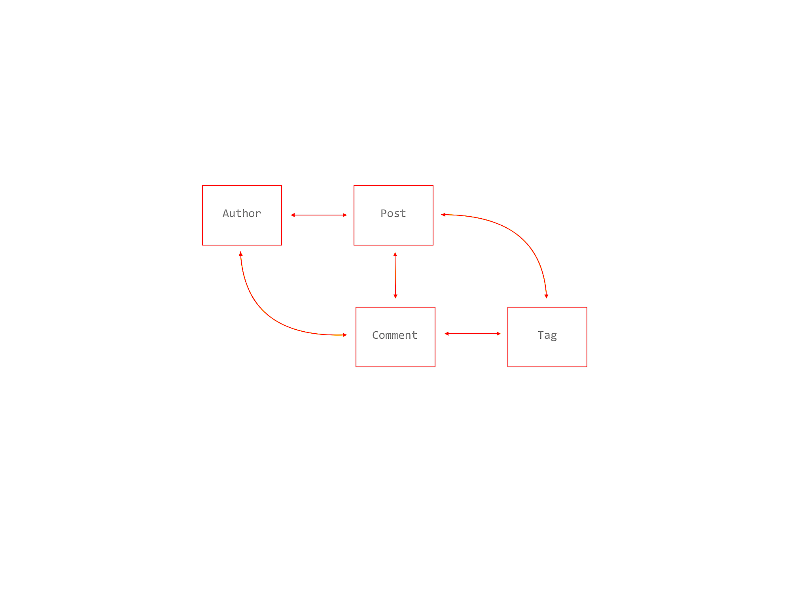

# What is GraphQL

* Isn't a Database
* Isn't a OR-Mapper
* Isn't OData, WebDav, etc.
* Isn't a Protocol
* Isn't a transport layer

__GraphQL is ...__

* A __type and query specification__
* GraphQL services can be written in __any language__
* __Common interface__ between the client and the server
* A __structured hierarchically__ (top-down) data relations resolver
* __Optimized for data fetching__ and manipulations

> API consumers of relational data structures needs flexible requests and responses 

## Common Use Cases

* Common API for Web-, Mobile- and Service-Consumers
* Data-Driven (relational) Applications
* API-Gateway for Databases
* API-Gateway for Micro/Web-Services 
* API-Gateway for Messaging/Broker-Systems
* Reactive Applications
* CQRS