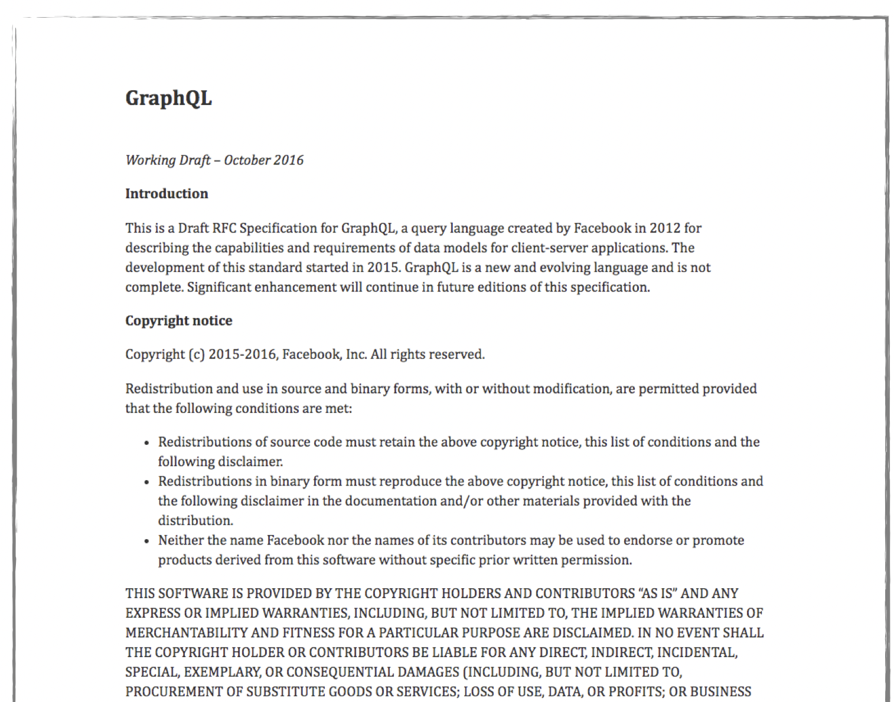
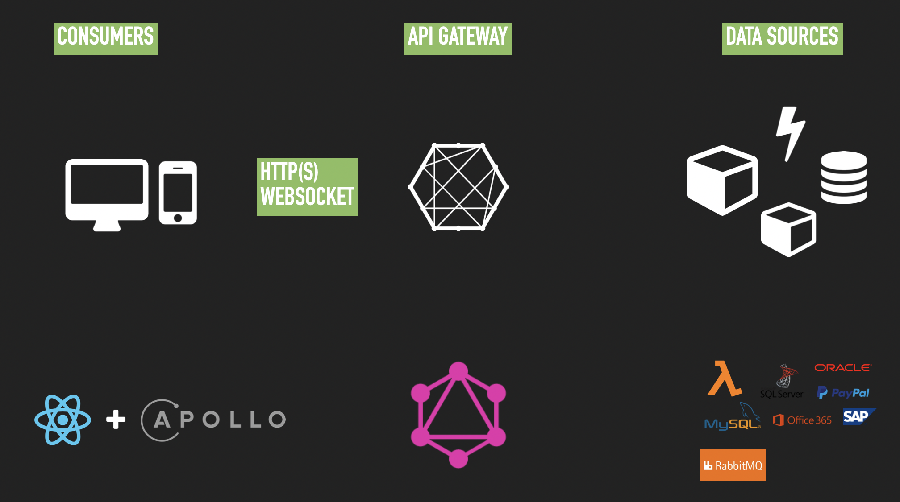
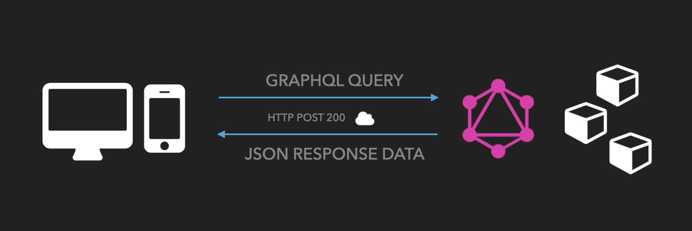
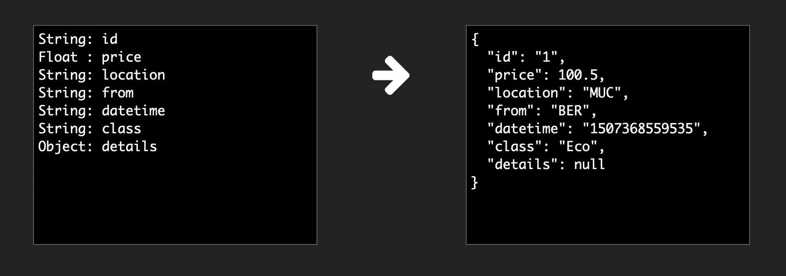
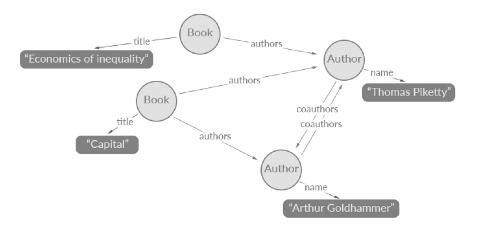

# What is GraphQL

- Isn't a Database
- Isn't a OR-Mapper
- Isn't OData, WebDav, etc.
- Isn't a Protocol
- Isn't a transport layer

**GraphQL is a specifcation! (https://spec.graphql.org/June2018/)**

## GraphQL is a unified data API

> API consumers of relational data structures needs flexible requests and responses

- A **type and query specification**
- GraphQL services can be written in **any language**
- **Common interface** between the client and the server
- A **structured hierarchically** (top-down) data relations resolver
- **Optimized for data fetching** and manipulations

## Common Use Cases

- Common API for Web-, Mobile- and Service-Consumers
- Data-Driven (relational) Applications
- API-Gateway for Databases
- API-Gateway for Micro/Web-Services
- API-Gateway for Messaging/Broker-Systems
- Reactive Applications
- CQRS

## HTTP(S) based Communication (e.g. WebSockets for Subscriptions)

## Data with GraphQL

- Structure
- Types
- Relations
- Values

## Who using GraphQL

[GraphQL Users](http://graphql.org/users/)

## GraphQL Data Relations

