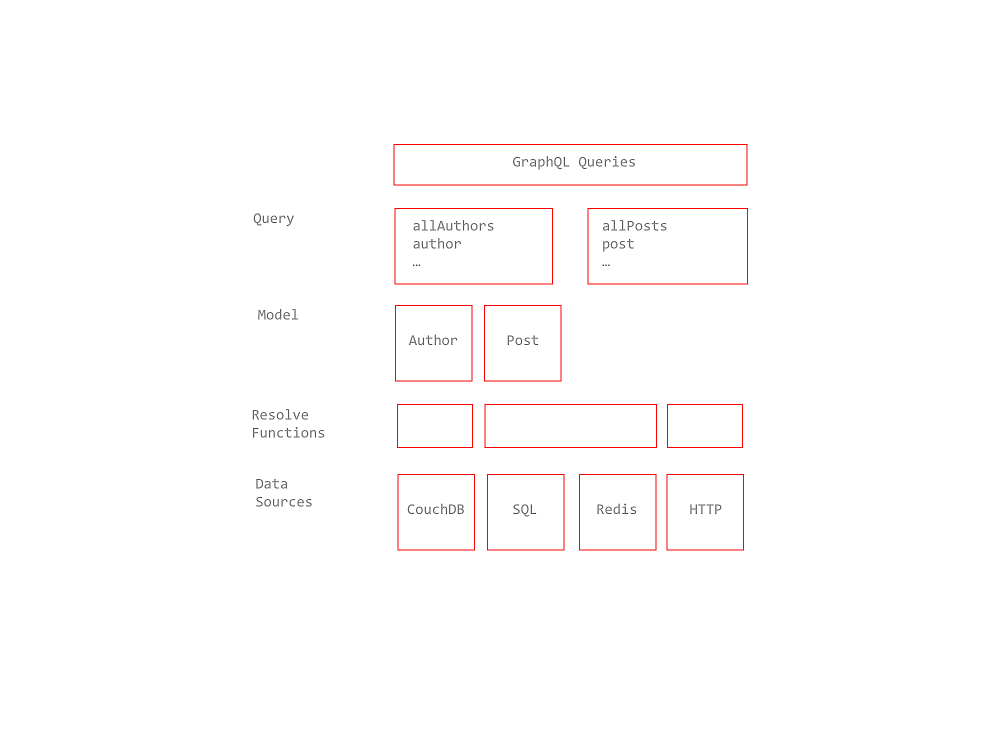
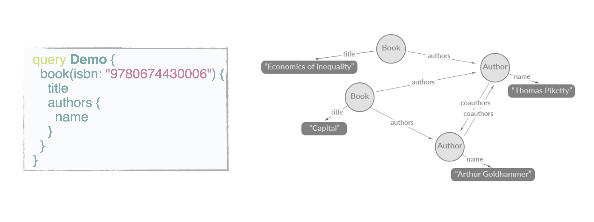
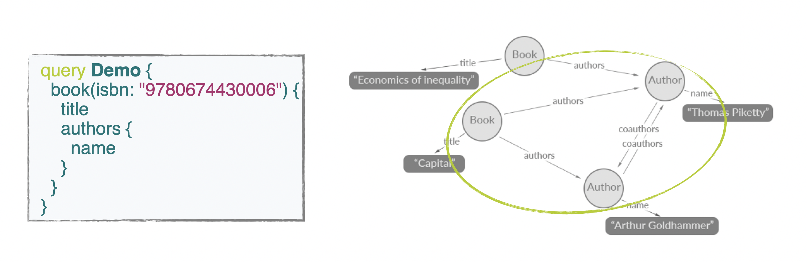

# Principles

- **Hierarchical** A GraphQL query itself is structured hierarchically
- **Product centric** GraphQL is unapologetically driven by the requirements of views and the frontend engineers that write them
- **Strongly typed** Every GraphQL server defines an application specific type system
- **Client‐specified queries** Through its type system, a GraphQL server publishes the capabilities that its clients are allowed to consume.
- **Introspective** A GraphQL server is queryable by the GraphQL language
- **Version free** GraphQL removes the need for an incrementing version number

## GraphQL is conceptually organised in nodes and edges

> Fields might be edges.

> Queries selects portions of the graph.

