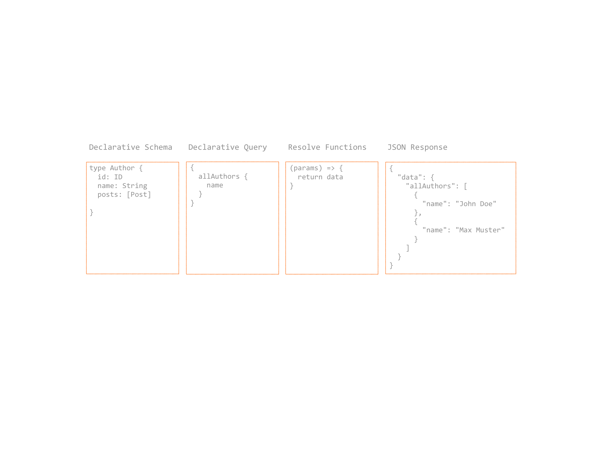
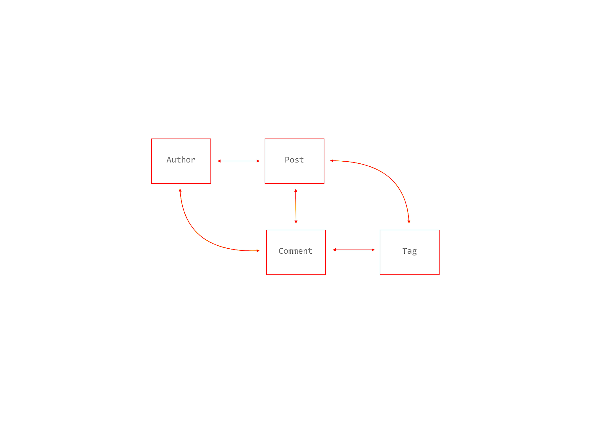

# GraphQL Queries



- One endpoint (GET/POST)
- Hierarchically structured
- Like JSON without JSON values
- Queries, Mutations and Subscriptions
- Support for Field-Query-Parameters and Variables
- Query validation for types and execution runtime on server side

## Anatomy of a GraphQL Request

```graphql
query FlightById {  
  flight(id: "1") {
    id
    price
    location
    details {
      capacity {
        seats
      }
    }
  }
}
```

```json
{
  "id": 1,
  "price": 23.44,
  "location": "TXL",
  "details": {
    "capacity": {
      "seats: 66
    }
  }
}
```

## Example


### Simple Query

```graphql
{
  allAuthors {
    id
    name
  }
}
```

### Named Query / Operation Name

```graphql
query fetch_all_authors {
  allAuthors {
    id
    name
  }
}
```

### Alias

```graphql
{
  authors: allAuthors {
    id
    name
  }
}
```

### Field Parameters

```graphql
{
  author(id: 1) {
    id
    name
  }
}
```