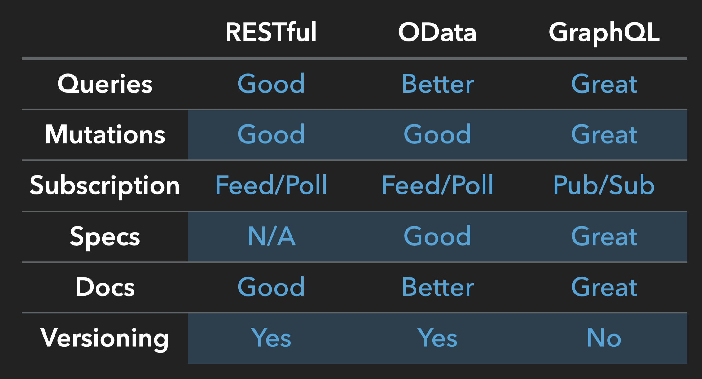

# Why GraphQL

## Restfullness

`GET /users/1/friends/1/dogs/1?include=user.name,dog.age`

Current APIs are:

- Mostly Resource-based (CRUD)
- Sometimes a JSON/RPC over HTTP(S)
- Mostly not well documented
- Doesn't have an explorative UI
- Mostly producer (Backend/Data) driven
- Versioning is difficult
- Expose untyped/schemaless contracts
- Dynamic Queries is hard to implement
- Needs explicit query validation
- Chatty Relation-Traversals (link rel traversal)
- Growing REST / Hypermedia APIs are complex
- Increases the effort for multiple representations (e.g. Desktop/Web/Mobile)
- Inconsistent REST/Hypermedia [Maturity Model](https://martinfowler.com/articles/richardsonMaturityModel.html)
- Sometimes obsure resource naming, relations and operations

## Some RESTful Example

### How to handle relations?

- `/flights/2/details` ?
- `/flightdetails/2` ?

```json
{
  "id": "2",
  "price": 50.56,
  "location": "BER",
  "from": "MUC",
  "datetime": "1507368559535",
  "class": "Business",
  "details": {
    "flightNo": "AB1234"
  }
}
```

Problems:

- Over-/Under-Fetching
- Multiple request/responses
- N+1 Queries

## 3rd/x level relation queries

- `/flights/2?include=id,price,details`

```json
{
  "id": "2",
  "price": 50.56,
  "details": {
    "flightNo": "AB1234",
    "capacity": {
      "seats": "102"
    }
  }
}
```

Problems:

- Missing relation depth 
- Query parameters in relations

## GraphQL for the win

```graphql
query FlightById {  
  flight(id: "1") {
    price
    location
    from 
    class
    details {
      capacity {
        seats
      }
    }
  }
}
```

- single roundtrip
- no under-/over-fetching
- N-depth relation queries
- relation parameters
- supports query modifiers (@skip, @take, @if, etc.)
- bulk queries and mutations

## API comparison

