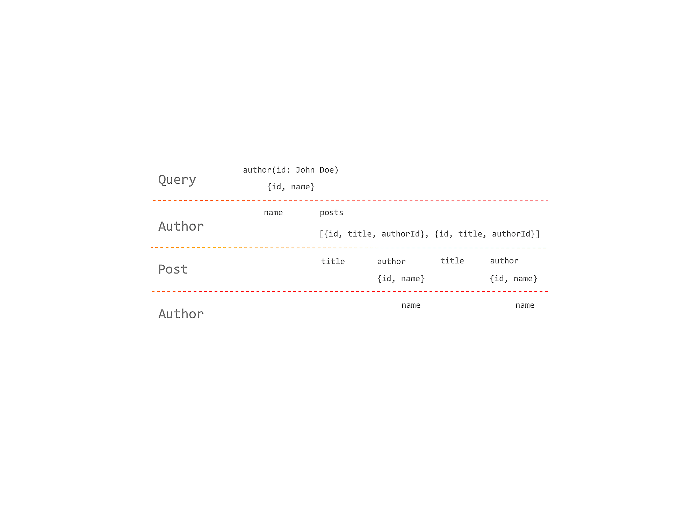

# GraphQL Query Resolver



- Functions to resolve types and fields in GraphQL schema
- Context, Arguments, Parent as Parameters
- Executed in a Top-Down execution flow via Visitor Pattern
- Sync/Async execution
- Can connected to various backends

## Resolver Arguments

- First argument **source** - Parent object of object tree
- Second argument **args** - Field arguments in query
- Third argument **context** - Request specific context object
- Fourth argument **info** - Information about the GraphQL execution state

## Resolve with Async/Await

```javascript
async (source, args, context, info) => {
    try {
        return {...}
    } catch (error)
        return {...}
    }
}
```

## Resolve with Promises

```javascript
(source, args, context, info) => {
    return new Promise((resolve, reject) => {
        ...
        resolve({}) / reject(new Error(...))
    })
}
```
