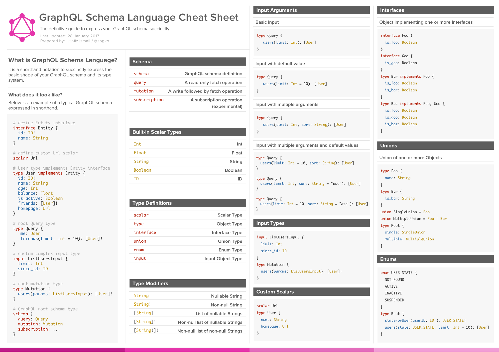

# GraphQL Schema

- GraphQL Schema- and Type-Language
- Similar to GraphQL Query-Language
- Declaration via Build-In Type-System
- `@deprecated` to mark as deprecated
- `#` for custom documentations
- Query, Mutation and Subscription are special types
- Exclicit Input-Type definitions

```graphql
type Author {
  id: ID
  rev: String
  fullname: String @deprecated(reason: "Use the 'name' field instead")
  name: String
  # Posts written by current author
  posts: [Post]
}

type Post {
  id: ID
  rev: String
  title: String
  text: String
  authorId: ID
  # Current author of post
  author: Author
}

type Query {
    # Query all authors
  authors: [Author]
  # Query author by ID
  author(id: ID!): Author
}
```

