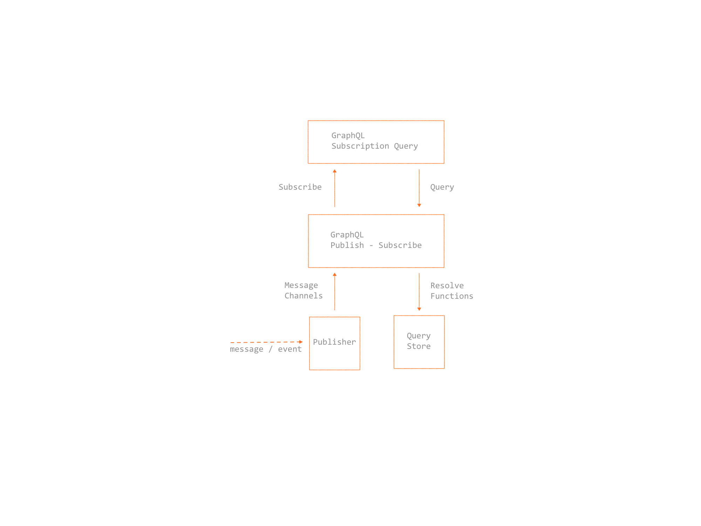

# Subscriptions



* Publish/Subscribe Pattern
* Transport via different protocols (WebSockets, HTTP Event-Source, HTTP-Stream, HTTP/2)

## Use Cases
* GraphQL API-Gateway for different Messaging/Broker Systems
* Long running tasks via correlation/transaction ID

__Subscription Query__
```graphql
subscription upserted_author_subscription {
    upsertedAuthor {
        id
        name
        post {
            title
        }
    }
}
```