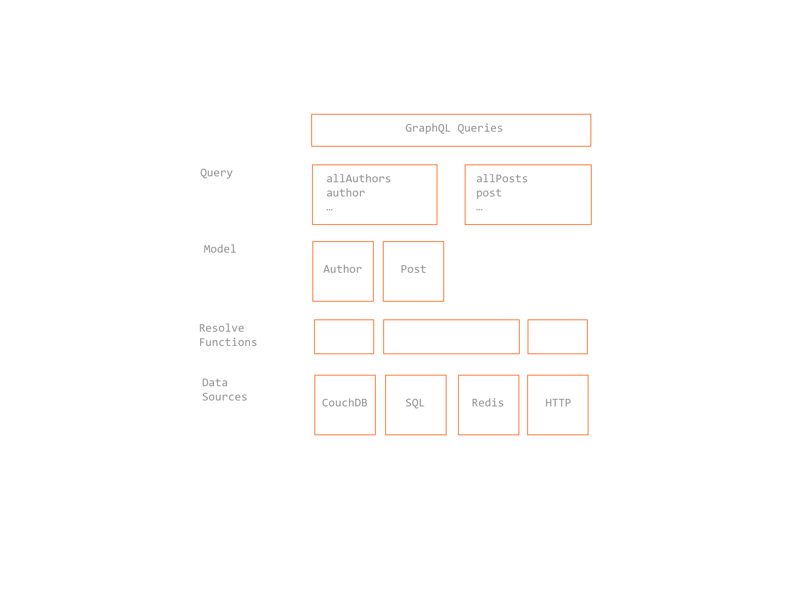

# Design Principles

* __Hierarchical__ A GraphQL query itself is structured hierarchically
* __Product centric__ GraphQL is unapologetically driven by the requirements of views and the frontend engineers that write them
* __Strongly typed__ Every GraphQL server defines an application specific type system
* __Client‐specified queries__ Through its type system, a GraphQL server publishes the capabilities that its clients are allowed to consume.
* __Introspective__ A GraphQL server is queryable by the GraphQL language
* __Version free__ GraphQL removes the need for an incrementing version number
